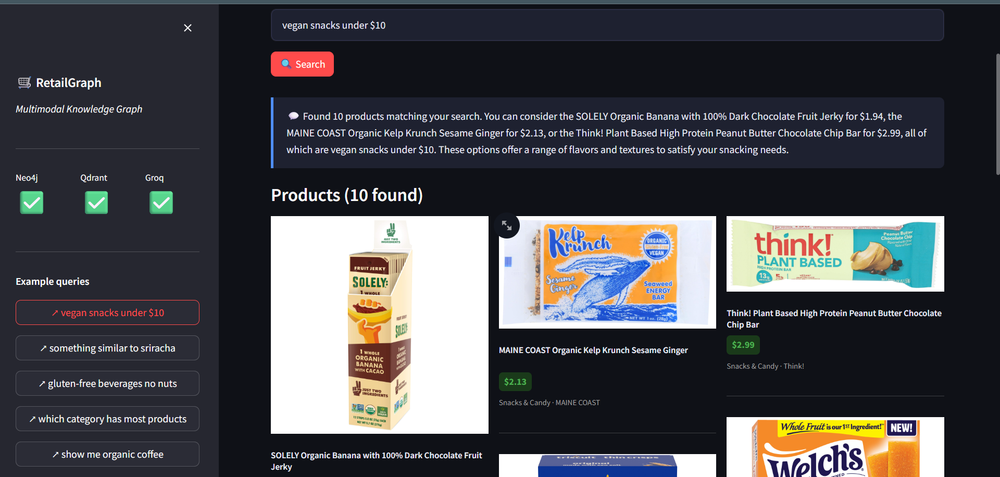
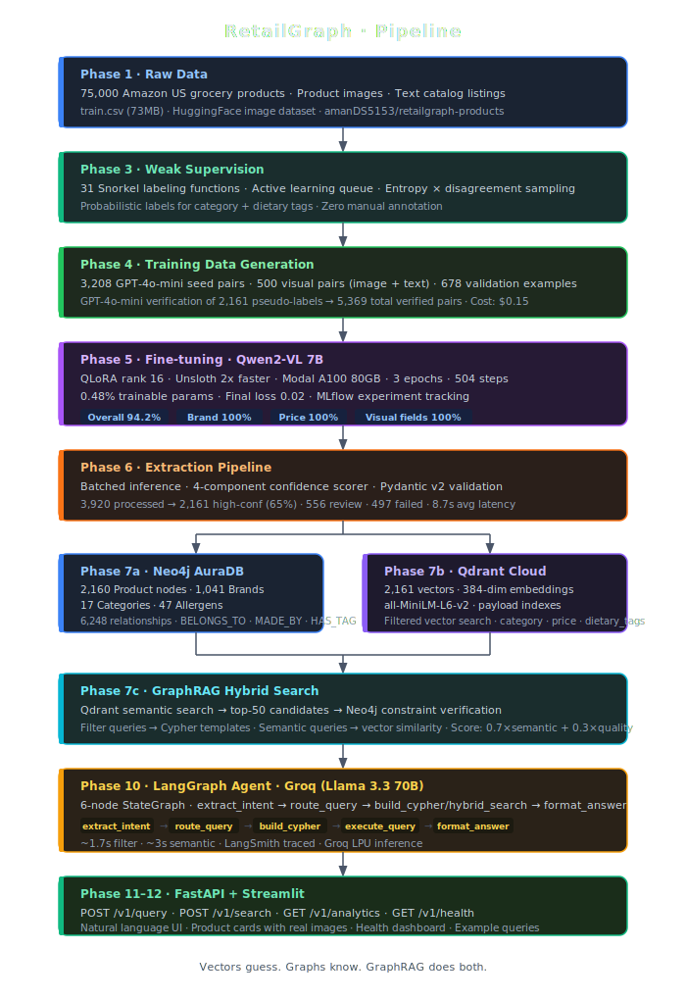
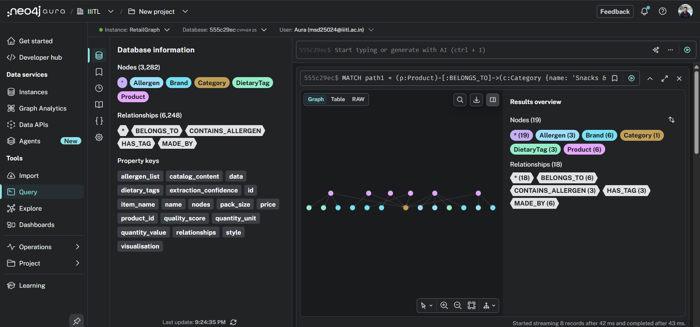

<div align="center">

# RetailGraph

**Multimodal entity extraction and knowledge graph platform for large-scale grocery product catalogs.**

Fine-tunes Qwen2-VL 7B on 75k products → 94.2% field extraction accuracy → 
structured knowledge graph queryable in plain English via a LangGraph + GraphRAG agent.

[](https://python.org)
[](https://huggingface.co/Qwen/Qwen2-VL-7B-Instruct)
[](#results)
[](https://neo4j.com)
[](https://qdrant.tech)
[](https://langchain-ai.github.io/langgraph/)
[](https://smith.langchain.com)
[](https://fastapi.tiangolo.com)

</div>

---

## What It Does

Raw grocery product listings (text + images) go in → a fine-tuned vision-language model extracts structured entities (brand, category, allergens, dietary tags, price) → everything loads into a typed Neo4j knowledge graph → a LangGraph agent answers natural language queries in plain English using GraphRAG hybrid search across both Neo4j and Qdrant.

> **"Vectors guess. Graphs know. GraphRAG does both."**

---

## Demo



*Natural language query → LLM-generated answer → product cards with real images. Neo4j ✅ Qdrant ✅ Groq ✅*

---

## Architecture



---

## Results

<div align="center">

| 94.2% Extraction Accuracy | 6,248 Graph Relationships | 2,161 Vectors | <3s Query Latency |
|:---:|:---:|:---:|:---:|
| 678 val examples · 0 parse errors | 2,160 nodes · 17 categories | 384-dim · Qdrant Cloud | filter queries · Groq LPU |

</div>

### Training Rounds

| Round | Dataset | Overall | Category | Dietary Tags | Notes |
|---|---|---|---|---|---|
| Round 1 | 3,208 pairs | 94.3% | 82.0% | 83.3% | GPT-4o-mini seed pairs |
| Round 2 | 5,369 pairs | 91.8% | 66.2% | 74.6% | ❌ Self-training backfired |
| **Round 3** | **5,369 pairs** | **94.2%** | **78.3%** | **85.7%** | ✅ GPT-4o-mini verified labels |

### Field Accuracy (Round 3 · 678 validation examples)

| Field | Exact Match | LLM Judge Score | |
|---|---|---|---|
| Brand | 100% | — | ✅ |
| Price | 100% | — | ✅ |
| Pack Size | 100% | — | ✅ |
| Packaging (visual) | 100% | — | ✅ |
| Quantity Unit | 92.6% | — | ✅ |
| Allergen List | 91.5% | 4.68 / 5 | ✅ |
| Dietary Tags | 85.7% | 4.47 / 5 | ✅ · 38 false negatives caught by judge |
| Category | 78.3% | 4.22 / 5 | ⚠️ Genuine weak field |
| **Overall** | **94.2%** | — | **0 parse errors · 8.7s avg inference** |

> LLM-as-Judge (GPT-4o-mini) scores semantic correctness independently of exact string match — the same evaluation pattern used internally at OpenAI and Anthropic.

---

## Technical Deep Dive

### Multimodal Fine-Tuning — Qwen2-VL 7B

| Metric | Value |
|---|---|
| Base model | Qwen/Qwen2-VL-7B-Instruct |
| Method | QLoRA rank 16, alpha 32 |
| Trainable params | 40.4M / 8.3B (0.48%) |
| Training data | 5,369 verified pairs (3,208 text + 500 visual + 2,161 pseudo-verified) |
| Epochs | 3 · 504 steps · batch size 32 |
| Final loss | 0.02 |
| Inference latency | 8.7s avg per product |
| Infrastructure | Modal A100 80GB · Unsloth 2x faster training |
| Experiment tracking | MLflow · all rounds logged |

### Self-Training Loop — Data Flywheel

| Stage | Action | Result |
|---|---|---|
| Round 1 | Train on 3,208 GPT-4o-mini pairs | 94.3% overall |
| Phase 6 | Extract 3,920 products → 2,161 high-conf | 65% confidence pass rate |
| Round 2 | Retrain on raw pseudo-labels | 91.8% — **degraded** |
| Fix | GPT-4o-mini verifies category + dietary_tags on 2,161 extractions | 487 categories corrected (22.5%) · 298 tags corrected (13.8%) · cost $0.15 |
| Round 3 | Retrain on 5,369 verified pairs | 94.2% — restored |

### Knowledge Graph — Neo4j + Qdrant

| Metric | Value |
|---|---|
| Product nodes | 2,160 |
| Brand nodes | 1,041 |
| Category nodes | 17 |
| DietaryTag nodes | 17 |
| Allergen nodes | 47 |
| Total relationships | 6,248 |
| Relationship types | BELONGS_TO · MADE_BY · HAS_TAG · CONTAINS_ALLERGEN |
| Qdrant vectors | 2,161 · 384-dim · all-MiniLM-L6-v2 |
| Deduplication | RapidFuzz token_sort_ratio > 92% · 1 exact + 16 fuzzy duplicates removed |

### LangGraph Agent

| Metric | Value |
|---|---|
| LLM | Groq · Llama 3.3 70B · LPU inference |
| Nodes | 6 — extract_intent → route_query → build_cypher / hybrid_search → execute_query → format_answer |
| Query types | Filter · Semantic · Analytics · Hybrid |
| Filter query latency | ~1.7s |
| Semantic query latency | ~3s |
| Observability | LangSmith · every node traced · shareable trace URLs |
| Cypher strategy | Pre-built templates for 80% of queries · Groq-generated for remainder |

---

## Knowledge Graph



*All 5 node types and 4 relationship types. Query: Snacks & Candy subgraph showing Product → BELONGS_TO → Category, MADE_BY → Brand, HAS_TAG → DietaryTag, CONTAINS_ALLERGEN → Allergen.*

---

## Tech Stack

| Component | Technology | Purpose |
|---|---|---|
| Extraction model | Qwen2-VL 7B (fine-tuned) | Multimodal entity extraction — text + images |
| Fine-tuning | Unsloth + QLoRA + Modal A100 | Domain adaptation, zero API cost at inference |
| Weak supervision | Snorkel · 31 labeling functions | Probabilistic labels — zero manual annotation |
| Schema validation | Pydantic v2 | Type-safe data contract + 3-step retry loop |
| Knowledge graph | Neo4j AuraDB | Structured facts + multi-hop Cypher queries |
| Vector store | Qdrant Cloud | Semantic similarity + filtered vector search |
| Hybrid search | GraphRAG (Neo4j + Qdrant) | Graph facts + vector context = better answers |
| Agent framework | LangGraph | 6-node typed state machine |
| LLM inference | Groq · Llama 3.3 70B | Sub-2s intent extraction + answer formatting |
| LLM evaluation | LLM-as-Judge (GPT-4o-mini) | Semantic scoring beyond exact string match |
| Observability | LangSmith | Per-node tracing · latency · token cost |
| Normalization | RapidFuzz + YAML adapters | Canonical field mapping + fuzzy deduplication |
| Experiment tracking | MLflow | All training rounds logged |
| Backend | FastAPI | REST API · 5 endpoints |
| Frontend | Streamlit | NL search UI · product cards · health dashboard |
| Cloud GPU | Modal A100 80GB | Training + batch inference |

---

## Quick Start

```bash
git clone https://github.com/AmanDataGuy/RetailGraph
cd RetailGraph
pip install -r requirements.txt
cp .env.example .env
# fill in NEO4J_URI, NEO4J_PASSWORD, QDRANT_URL, QDRANT_API_KEY, GROQ_API_KEY, LANGCHAIN_API_KEY
```

```bash
# Load knowledge graph (one-time)
python scripts/create_indexes.py
python src/graph/builder.py
```

```bash
# Start the stack
uvicorn src.api.main:app --reload --port 8000
streamlit run app.py --server.port 8501
```

FastAPI Swagger UI at `localhost:8000/docs` · Streamlit at `localhost:8501`

---

## Project Status

| Phase | Description | Status |
|---|---|---|
| 0–2 | Foundation · schema · normalization · validation | ✅ Complete |
| 3 | Weak supervision — 31 Snorkel LFs | ✅ Complete |
| 4 | Training data — 5,369 verified pairs | ✅ Complete |
| 5 | Fine-tuning Qwen2-VL 7B — Round 3 (94.2%) | ✅ Complete |
| 6 | Extraction pipeline — 2,161 high-conf products | ✅ Complete |
| 7 | Neo4j + Qdrant + GraphRAG hybrid search | ✅ Complete |
| 8 | LLM-as-Judge evaluation + LangSmith tracing | ✅ Complete |
| 9 | Kafka real-time streaming | ⏭️ Skipped |
| 10 | LangGraph agent — Groq + GraphRAG | ✅ Complete |
| 11 | FastAPI REST API | ✅ Complete |
| 12 | Streamlit frontend | ✅ Complete |
| 13 | GraphRAG vs VectorRAG benchmark | ✅ Complete |
| 14 | Docker + CI/CD | 🔄 Planned |


---

## Benchmark — GraphRAG vs VectorRAG vs Neo4j

20 queries across 3 types · ground truth scoring

| System | Accuracy | Avg Latency | Notes |
|---|---|---|---|
| Vector only (Qdrant) | 0 / 20 (0%) | ~0s | Semantic retrieval only — no constraint enforcement |
| Graph only (Neo4j) | 20 / 20 (100%) | 1.3s | Structured queries only — no semantic ranking |
| **GraphRAG (hybrid)** | **18 / 20 (90%)** | **9.99s** | Semantic + constraints combined |

### By query type

| Type | Vector | Graph | GraphRAG |
|---|---|---|---|
| Multi-constraint (price + tags) | 0 / 7 | 7 / 7 | 7 / 7 |
| Semantic (similarity-based) | 0 / 7 | 7 / 7 | 7 / 7 |
| Analytics (aggregations) | 0 / 6 | 6 / 6 | 4 / 6 |

**Key finding:** Vector search alone fails every query because it cannot enforce hard constraints (price limits, dietary tags). GraphRAG matches Graph on multi-constraint and semantic queries, with the 2 failures on pure analytics aggregations where no semantic component exists — pure Cypher is the right tool there. The agent layer (Phase 10) routes analytics queries directly to Neo4j, bypassing Qdrant entirely.

---

## What Didn't Work

**Round 2 self-training collapsed.** After extracting 2,161 high-confidence products with the Round 1 model (82% category accuracy), I merged those pseudo-labels directly into the training set and retrained. Category accuracy dropped from 82% to 66.2% — the model learned to repeat its own errors more confidently. The fix was a GPT-4o-mini verification pass on just the two weak fields (category + dietary_tags), correcting 487 wrong categories and 298 wrong tag sets for $0.15. Round 3 restored 94.2%. The lesson: data quality beats data quantity, and a teacher model needs 95%+ accuracy before its outputs are safe to train on.

---

<div align="center">

*Vectors guess. Graphs know. GraphRAG does both.*

**[LinkedIn](https://www.linkedin.com/in/aman-dataguy/) · [GitHub](https://github.com/AmanDataGuy/RetailGraph) · [HuggingFace Dataset](https://huggingface.co/datasets/amanDS5153/retailgraph-products)**

</div>
