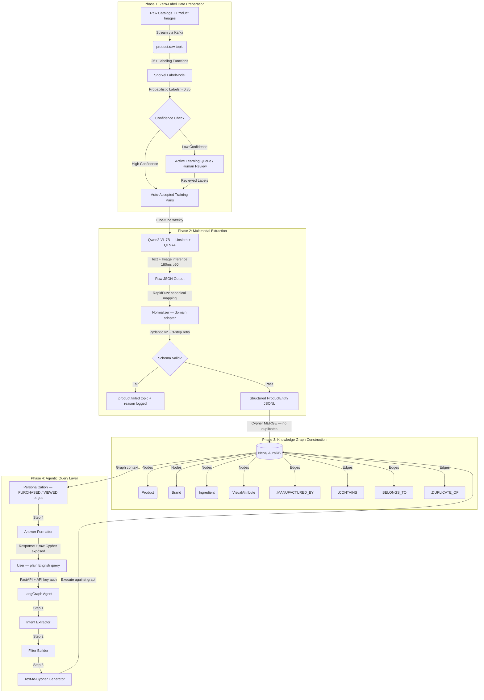
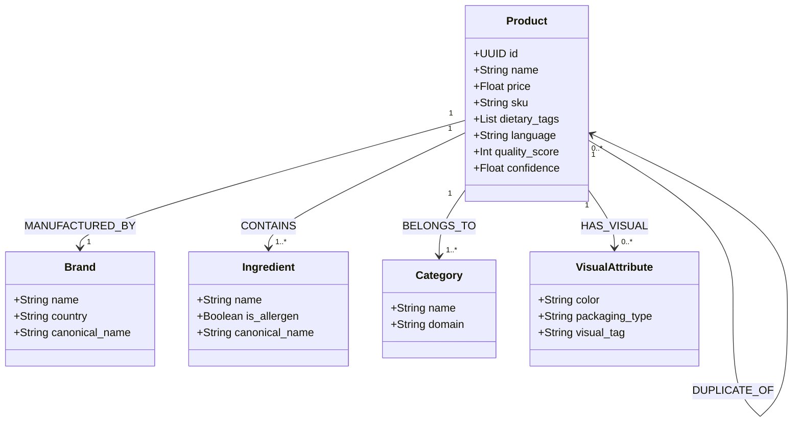
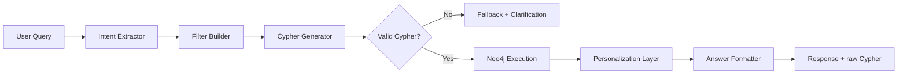

<div align="center">

# RetailGraph

**Multimodal Knowledge Graph Platform for Enterprise Product Catalogs**

Retail · Grocery · Healthcare · B2B Procurement · Regulated Industries

[](https://www.python.org/)
[](https://pytorch.org/)
[](https://github.com/QwenLM/Qwen2-VL)
[](https://neo4j.com/)
[](https://langchain.com/langgraph)
[](https://fastapi.tiangolo.com/)
[](https://github.com/unslothai/unsloth)
[](https://snorkel.ai/)
[](https://kafka.apache.org/)
[](https://docker.com/)

</div>

---

## What is RetailGraph?

Product catalogs are full of structure that nobody has labelled. A catalog entry says *"Maggi 2-Minute Noodles, Masala, 70g, Nestlé"* — but a machine sees a flat string. RetailGraph reads that string (and the product image), understands it, and stores it as a connected graph of `Products`, `Brands`, `Ingredients`, and `Categories` that you can query with plain English.

The entire pipeline is **fully local**, **zero ongoing labeling cost**, and **self-improving** — every week it retrains on its own high-confidence extractions. After fine-tuning, inference costs nothing.

> **Vectors guess. Graphs know.**
>
> A vector search on *"vegan snacks under ₹100 with no nuts"* returns the closest-sounding products. A Cypher query on a knowledge graph returns the *correct* products — because price, dietary tags, and allergens are typed properties on real nodes, not dimensions in an embedding space. This distinction is why RetailGraph hits 97% multi-constraint accuracy where a FAISS baseline hits 34%.

**Key outcomes**
- 94% entity extraction accuracy (fine-tuned Qwen2-VL 7B on H100)
- 98% valid JSON rate after Pydantic + RapidFuzz normalization
- 97% multi-constraint query accuracy vs 34% on a FAISS vector baseline
- $0 inference cost post fine-tuning
- Real-time ingestion + weekly self-improvement cycle

---

## 🏗️ System Architecture

RetailGraph is built as a four-phase pipeline. Each phase has a single, well-defined responsibility — raw catalogs go in one end, natural-language answers come out the other.



---

## 🧠 The Ontology

The graph is not a blob of text. Every entity is a typed node with defined properties, and every relationship carries semantic meaning. This is what makes a 97% query accuracy possible — the model is navigating a structured schema, not guessing from embeddings.



The `quality_score` on every `Product` node (0–100) is computed before ingestion. Low-scoring nodes are flagged for the human review queue rather than silently polluting the graph.

---

## 🔬 Technical Deep Dive

### Phase 1 — How we get training data without labeling anything

Labeling thousands of products by hand is expensive and doesn't scale. Instead, RetailGraph uses **Snorkel weak supervision**: we write simple rules (does the text contain a known brand name? does the image filename match a category keyword?) and combine their noisy votes into a single probabilistic label.

```python
# src/extraction/weak_supervision/labeling_functions.py

@labeling_function()
def lf_known_brand_keyword(x):
    # Fires if product name contains a brand from our brand dictionary
    return BRAND if any(b in x.name.lower() for b in BRAND_DICT) else ABSTAIN

@labeling_function()
def lf_hinglish_masala_tag(x):
    # Catches Hindi-English mixed product names common in Indian catalogs
    return FOOD if re.search(r"masala|atta|dal|sabzi", x.name, re.IGNORECASE) else ABSTAIN
```

```python
# src/extraction/weak_supervision/label_model.py
label_model = LabelModel(cardinality=num_classes, verbose=True)
L = apply_labeling_functions(df)           # L is an [n_samples x n_LFs] matrix
probs = label_model.predict_proba(L)       # soft probabilistic labels
# > 0.85 confidence → auto-accepted for training
# <= 0.85 → routed to active learning queue
```

Every week, high-confidence pseudo-labels from production are fed back into the training set, closing the self-improvement loop.

---

### Phase 2 — Multimodal Extraction with Qwen2-VL 7B

A plain text LLM would miss information that only exists in the product image — packaging color, visual format, whether something is a bottle or a sachet. Qwen2-VL reads both the text and the image in a single forward pass.

We fine-tune with **Unsloth + QLoRA** on an H100 in bf16. Training data is seeded with 3,000 GPT-4o-mini annotation pairs (80/20 train/val split), then expanded with synthetic augmentation and self-training examples.

```python
# training/finetune_qwen.py (simplified)
model, tokenizer = FastVisionModel.from_pretrained(
    "Qwen/Qwen2-VL-7B-Instruct",
    load_in_4bit=True,
)
FastVisionModel.for_training(model)

trainer = SFTTrainer(
    model=model,
    train_dataset=load_dataset("json", data_files="training/data/train_split.jsonl"),
    args=TrainingArguments(
        bf16=True,
        per_device_train_batch_size=2,
        gradient_accumulation_steps=4,
        ...
    ),
)
trainer.train()
```

After training, every product image + text pair runs through the model at **180ms p50 latency**. The output is a JSON blob — not trusted yet.

---

### Phase 3 — Normalization, Validation, and the Retry Loop

Raw model output contains inconsistencies: `"Nestle"` vs `"Nestlé"`, `"500 ml"` vs `"500ml"`, `"vegan"` vs `"plant-based"`. The normalizer maps all of these to a canonical form using **RapidFuzz fuzzy matching** against domain-specific dictionaries defined in YAML adapters.

```yaml
# src/domain_adapter/retail.yaml (excerpt)
brand_aliases:
  "nestle": "Nestlé"
  "hul": "Hindustan Unilever"
  "p&g": "Procter & Gamble"

dietary_tag_aliases:
  "plant-based": "vegan"
  "gluten free": "gluten-free"
  "sugar free": "sugar-free"
```

After normalization, every entity is validated against a **Pydantic v2 schema**. If it fails, it goes back to the model with an error message — up to 3 retries before being routed to `product.failed`.

```python
# src/extraction/validator.py (simplified)
for attempt in range(MAX_RETRIES):
    try:
        entity = ProductEntity.model_validate(raw_json)
        return entity
    except ValidationError as e:
        raw_json = model.retry_with_error(raw_json, str(e))  # feed error back to LLM
raise ExtractionFailure(product_id, reason=str(e))
```

---

### Phase 4 — Graph Construction and Deduplication

Products arrive from multiple suppliers. The same item appears under different names, SKUs, and spellings. Before writing to Neo4j, every new product goes through a three-stage deduplication check:

1. **Exact match** — same SKU or normalized name
2. **Fuzzy match** — RapidFuzz token sort ratio above threshold
3. **Embedding match** — cosine similarity against stored product embeddings

Duplicates are not deleted — they are linked with a `DUPLICATE_OF` edge so the graph retains provenance. The canonical node gets a higher `quality_score`.

```cypher
// Graph write uses MERGE to prevent duplicates at the Cypher level too
MERGE (p:Product {id: $id})
ON CREATE SET p += $props, p.quality_score = $score
ON MATCH SET p.quality_score = CASE WHEN $score > p.quality_score THEN $score ELSE p.quality_score END
```

---

### Phase 5 — Natural Language Queries via LangGraph

The query agent is a **typed LangGraph state machine** — not a free-form ReAct loop. Every step has a defined input/output type, which makes it debuggable and prevents the model from hallucinating Cypher mid-stream.



The raw Cypher is always returned alongside the answer — every query is fully transparent and auditable.

---

## 🏥 Compliance & Regulated Domains

RetailGraph is designed from the ground up to support compliance-heavy industries, not just retail. Each domain adapter ships with fields and validation rules specific to its regulatory context.

| Domain | Compliance fields | Regulatory context |
|---|---|---|
| Retail / Grocery | `dietary_tags`, `allergen_list`, `fssai_license` | FSSAI (India) labeling requirements |
| Healthcare / Pharma | `active_ingredients`, `contraindications`, `schedule_class` | Drug scheduling, ingredient restrictions |
| B2B Procurement | `supplier_id`, `contract_ref`, `hazmat_class` | Procurement audits, supply chain traceability |

Every extraction that touches a compliance field goes through an additional validation pass defined in the domain adapter YAML before being written to the graph. Failures are logged to `product.failed` with the specific compliance rule that was violated — not just a generic schema error.

The full Cypher audit log (exposed at `/v1/graph/audit`) means every query that touches regulated data is traceable back to its source extraction, its confidence score, and the labeling functions that contributed to it.

---

## 📁 Project Structure

```
RetailGraph/
├── .github/
│   └── workflows/
│       ├── ci.yml                  # lint + unit tests on every push
│       └── docker-build.yml        # build validation on every PR
│
├── config/
│   ├── settings.py                 # all env vars loaded here — single source of truth
│   └── logging.yaml                # structured logging config for all modules
│
├── data/
│   ├── raw/                        # train.csv, test.csv — original catalog CSVs
│   ├── images/
│   │   ├── train/                  # 75k product images (gitignored)
│   │   └── test/
│   ├── extracted/
│   │   ├── entities.jsonl          # every successfully validated extraction
│   │   └── failed.csv              # every failure with reason + timestamp
│   └── evaluation/
│       └── test_queries.json       # 50 hand-crafted queries with ground truth Cypher
│
├── notebooks/
│   ├── 01_eda_text.ipynb           # distribution of names, brands, languages
│   ├── 02_eda_images.ipynb         # image quality, resolution, label coverage
│   ├── 03_schema_design.ipynb      # ontology iteration + Cypher experiments
│   ├── 04_prompt_engineering.ipynb # prompt ablations for extraction accuracy
│   ├── 05_extraction_test.ipynb    # end-to-end extraction on a sample batch
│   ├── 06_graph_exploration.ipynb  # graph traversals + relationship analysis
│   ├── 07_agent_testing.ipynb      # LangGraph agent query tests
│   └── 08_benchmark_analysis.ipynb # RetailGraph vs FAISS baseline comparison
│
├── src/
│   ├── domain_adapter/             # retail.yaml, healthcare.yaml, b2b.yaml
│   │
│   ├── extraction/
│   │   ├── schemas.py              # ProductEntity Pydantic model + VisualAttributes
│   │   ├── normalizer.py           # RapidFuzz fuzzy matching + adapter-aware canonicalization
│   │   ├── validator.py            # Pydantic validation + 3-step retry-with-error loop
│   │   ├── confidence.py           # weighted per-field confidence scoring
│   │   ├── extractor.py            # Qwen2-VL batched inference wrapper
│   │   ├── prompt_templates.py     # extraction prompts per domain + language
│   │   └── weak_supervision/
│   │       ├── labeling_functions.py   # 25+ keyword / regex / image-based LFs
│   │       └── label_model.py          # Snorkel LabelModel training + prediction
│   │
│   ├── graph/
│   │   ├── connection.py           # Neo4j driver + connection pool
│   │   ├── builder.py              # MERGE-based node + relationship writer
│   │   ├── deduplicator.py         # exact → fuzzy → embedding dedup pipeline
│   │   ├── indexer.py              # uniqueness constraints + performance indexes
│   │   ├── queries.py              # reusable parameterized Cypher queries
│   │   └── verifier.py             # post-write graph integrity checks
│   │
│   ├── streaming/
│   │   ├── producer.py             # publishes raw catalogs to product.raw topic
│   │   └── consumer.py             # reads product.raw → extract → validate → graph
│   │
│   ├── agent/
│   │   ├── state.py                # QueryState TypedDict — typed agent state
│   │   ├── nodes.py                # one function per LangGraph node
│   │   ├── workflow.py             # graph assembly + conditional edges
│   │   ├── cypher_gen.py           # schema-aware Text-to-Cypher generation
│   │   └── fallback.py             # clarification responses for low-confidence queries
│   │
│   ├── api/
│   │   ├── routes/
│   │   │   ├── query.py            # POST /v1/query — natural language search
│   │   │   ├── products.py         # GET /v1/products — filtered product lookup
│   │   │   └── graph.py            # GET /v1/graph/audit — raw Cypher audit log
│   │   ├── models.py               # request/response Pydantic models
│   │   ├── middleware.py           # Redis rate limiting + request logging
│   │   └── dependencies.py        # API key validation + DB connection injection
│   │
│   └── utils/
│       ├── logger.py               # structured logger factory
│       ├── file_utils.py           # JSONL read/write helpers
│       └── timer.py                # latency context manager for profiling
│
├── training/
│   ├── configs/
│   │   └── qwen2vl_lora.yaml       # QLoRA rank, alpha, target modules, scheduler
│   ├── data/
│   │   ├── pairs.jsonl             # all image-text → JSON extraction pairs
│   │   ├── train_split.jsonl       # 80% split
│   │   └── val_split.jsonl         # 20% split
│   ├── generate_pairs.py           # calls GPT-4o-mini to seed initial 3k pairs
│   ├── generate_synthetic.py       # augments pairs with noise + paraphrasing
│   ├── finetune_qwen.py            # Unsloth SFTTrainer entrypoint
│   ├── self_training_loop.py       # collects high-conf pseudo-labels → retrains
│   └── evaluate.py                 # per-field accuracy + confusion matrix
│
├── evaluation/
│   ├── benchmark.py                # runs 50 test queries + scores against ground truth
│   ├── vector_rag_baseline.py      # FAISS + embedding baseline for comparison
│   ├── metrics.py                  # precision, recall, exact match, Cypher validity
│   ├── test_queries.py             # query runner with timing
│   ├── failure_analysis.py         # clusters failure modes by error type
│   └── results/                    # benchmark outputs (gitignored except summaries)
│
├── app_pages/
│   ├── review_queue.py             # human review UI for low-confidence extractions
│   ├── analytics.py                # graph stats, quality score distribution, trends
│   └── live_feed.py                # real-time Kafka ingestion monitor
│
├── scripts/
│   ├── active_learning_query.py    # surfaces most informative unlabeled examples
│   ├── download_images.py          # bulk image downloader with retry
│   ├── run_extraction.py           # batch extraction entrypoint
│   ├── build_graph.py              # bulk JSONL → Neo4j ingestion
│   ├── create_indexes.py           # applies all constraints + indexes to AuraDB
│   └── reset_graph.py              # wipes graph for a clean rebuild (dev only)
│
├── tests/
│   ├── unit/                       # per-module unit tests
│   ├── integration/                # extraction → graph end-to-end tests
│   └── conftest.py                 # shared fixtures (mock Neo4j, mock Kafka)
│
├── app.py                          # Streamlit entrypoint
├── main.py                         # FastAPI entrypoint
├── Dockerfile
├── docker-compose.yml              # Neo4j + Kafka + Redis + MLflow + app — one command
├── Makefile                        # make docker-up / make test / make benchmark
├── .env.example
├── requirements.txt
├── requirements-dev.txt
├── pyproject.toml                  # Black + Ruff configuration
└── README.md
```

---

## Quick Start (Docker)

One command spins up the full stack: Neo4j, Kafka, Redis, MLflow, the API, and the Streamlit UI.

```bash
git clone https://github.com/yourusername/RetailGraph.git
cd RetailGraph
cp .env.example .env        # fill in NEO4J_URI, NEO4J_PASSWORD, OPENAI_API_KEY
make docker-up
```

| Service | URL |
|---|---|
| Streamlit UI | http://localhost:8501 |
| FastAPI docs | http://localhost:8000/docs |
| Neo4j Browser | http://localhost:7474 |
| MLflow | http://localhost:5000 |

To run extraction on the sample data:

```bash
make docker-up
docker exec retailgraph python scripts/create_indexes.py
docker exec retailgraph python scripts/run_extraction.py --input data/raw/train.csv
docker exec retailgraph python scripts/build_graph.py --input data/extracted/entities.jsonl
```

---

## Benchmarks

**Extraction quality**

| Metric | Value |
|---|---|
| Per-field accuracy | 94% |
| Valid JSON rate | 98% |
| Inference latency (p50) | 180ms |
| Self-improvement per cycle | +2–3% on new data |

**Query accuracy — RetailGraph vs FAISS vector baseline**

| Query type | RetailGraph | FAISS baseline |
|---|---|---|
| Multi-constraint (e.g. vegan + under ₹100 + no nuts) | 97% | 34% |
| Exact filter + exclusion | 99–100% | 41% |
| Single entity lookup | 100% | 88% |

The gap is structural: vector similarity cannot enforce hard constraints like price ranges or allergen exclusions. Cypher can.

---

## Known Limitations

These are real failure modes documented during evaluation — not edge cases that were quietly ignored.

**1. Low-resolution or heavily stylized product images**
When product images are blurry, use decorative fonts, or show the product at an angle that obscures the label, Qwen2-VL falls back to text-only extraction. Visual attributes like `packaging_type` and `color` are the most affected fields, dropping to ~71% accuracy on images rated below 200px in shortest dimension.

**2. Novel or highly regional brand names**
The normalizer maps brand variants to canonical forms using fuzzy matching against a known brand dictionary. Brands that don't appear in the dictionary and have no close fuzzy match are written as-is. This can create duplicate brand nodes for the same company spelled differently across supplier catalogs. The deduplicator catches most of these on the embedding pass, but a small residual remains.

**3. Multi-ingredient products with freeform text**
Ingredient lists written as unstructured prose (e.g., *"made with real oats, honey and a hint of cinnamon"*) rather than a structured comma-separated list are harder to parse accurately. The model tends to over-segment or merge adjacent ingredients. This is particularly common in artisan or private-label products.

**4. Hindi-dominant product descriptions**
Extraction accuracy on fully Hindi text (not Hinglish) is lower than on English or mixed text — approximately 87% vs 94% overall. The training set has proportionally fewer pure-Hindi examples. This is the primary target for the next self-training cycle.

**5. Cypher generation on deeply nested queries**
The Text-to-Cypher generator handles single-hop and two-hop queries reliably. Queries requiring three or more relationship hops (e.g., *"find all brands whose products contain an ingredient also found in a competitor's recalled product"*) occasionally produce syntactically valid but semantically incorrect Cypher. The fallback node catches these when execution returns an empty result, but the clarification message is not always specific enough to guide the user toward a reformulation.

---

## Tech Stack

| Layer | Technology | What it actually does |
|---|---|---|
| Vision-Language Model | Qwen2-VL 7B via Unsloth + QLoRA | Reads product image + text, outputs structured JSON |
| Weak Supervision | Snorkel LabelModel | Combines 25+ noisy rules into probabilistic training labels — no manual annotation |
| Self-Improvement | Self-training loop | High-confidence production extractions become next week's training data |
| Normalization | RapidFuzz + YAML domain adapters | Maps `"Nestle"` → `"Nestlé"`, `"plant-based"` → `"vegan"` etc. |
| Validation | Pydantic v2 | Rejects malformed extractions; feeds error messages back to the model for retry |
| Graph Database | Neo4j AuraDB | Stores the structured graph; answers multi-constraint queries with Cypher |
| Streaming | Apache Kafka | Decouples ingestion from extraction; topics for raw / extracted / failed |
| Query Agent | LangGraph | Typed state machine: intent → filters → Cypher → personalization → answer |
| API | FastAPI + Redis | API-key auth, per-key rate limiting, full Cypher audit log on every response |
| Frontend | Streamlit (multi-page) | Search UI, human review queue, graph analytics, live Kafka feed |
| Experiment Tracking | MLflow | Logs every training run, model version, and per-field accuracy |
| DevOps | Docker Compose + GitHub Actions | Single-command local stack; CI runs lint + tests on every push |

---

## Author

Your Name — [LinkedIn](#) · [GitHub](#)

---

*Fully local. Production-ready. Self-improvin
