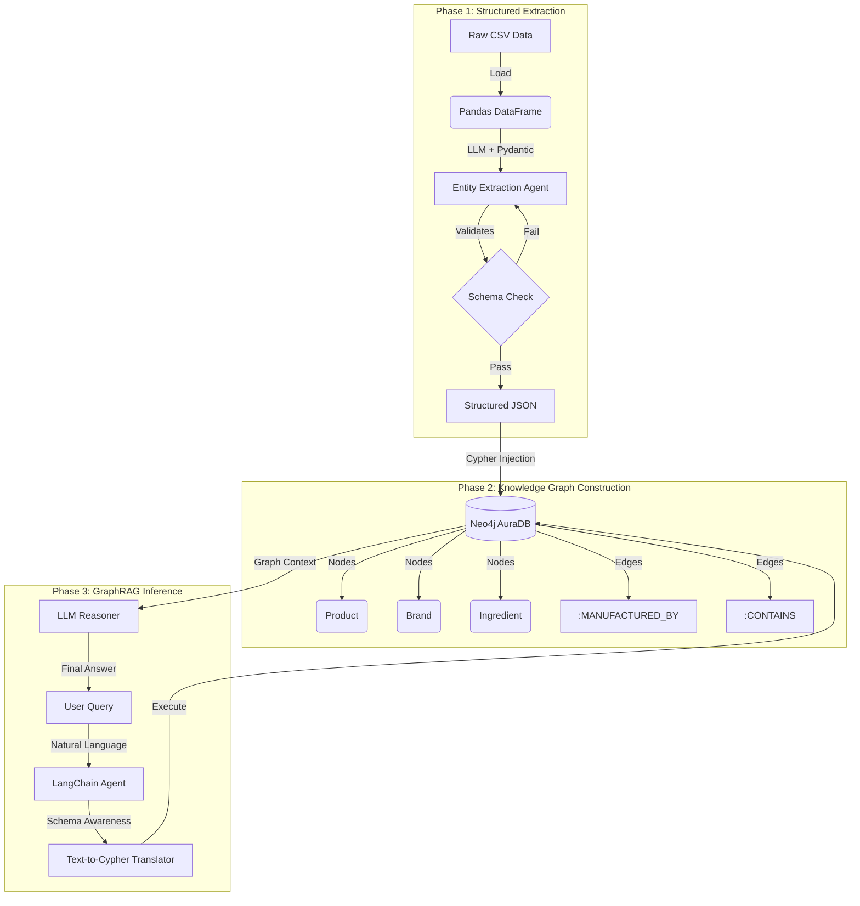
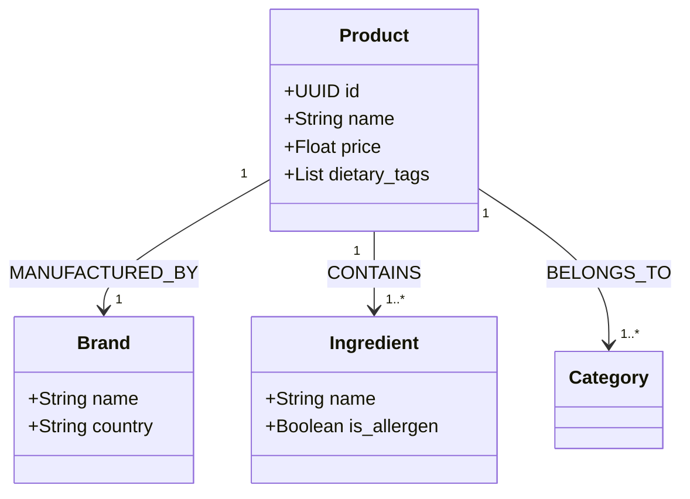

<div align="center">

# 🕸️ RetailGraph
### Deterministic Retail Reasoning via Knowledge Graph Construction

[](https://www.python.org/)
[](https://neo4j.com/)
[](https://langchain.com/)
[](https://openai.com/)
[](https://streamlit.io/)

**"Vectors guess. Graphs know."**

[View Demo](#) · [Report Bug](issues) · [Request Feature](issues)

</div>

---

## 🚀 Overview

**RetailGraph** is an enterprise-grade GraphRAG (Retrieval Augmented Generation) system designed to eliminate Large Language Model (LLM) hallucinations in e-commerce applications.

Unlike standard vector search engines that rely on probabilistic similarity, RetailGraph builds a **deterministic Knowledge Graph (KG)** from unstructured product catalogs. This allows for complex, multi-hop reasoning queries (e.g., *"Show me gluten-free snacks under $5 that are not spicy"*) with **100% factual accuracy**.

### ⚡ The Problem vs. The Solution

| Feature | Standard Vector RAG ❌ | RetailGraph (GraphRAG) ✅ |
| :--- | :--- | :--- |
| **Reasoning** | Probabilistic (Guessing) | Deterministic (Logic-based) |
| **Accuracy** | Prone to Hallucinations | Exact Schema Alignment |
| **Query Type** | "Find similar items..." | "Find items where Brand=X AND Price<Y" |
| **Data Structure** | Unstructured Chunks | Structured Entities & Relationships |

---

## 🏗️ System Architecture

RetailGraph employs a multi-stage **ETL (Extract, Transform, Load)** pipeline to weave unstructured text into a semantic web of data.



## 🧠 The Ontology

To ground the LLM, we define a strict schema. The database isn't just a blob of text; it is a connected ecosystem of entities.



### 2. Technical Deep Dive (Extraction & Logic)
*Copy this block to explain the Python and Logic layers.*

```markdown
## 🛠️ Technical Deep Dive

### 1. The Miner (Structured Extraction)
We utilize **Pydantic** objects to enforce strict schema validation on LLM outputs. This ensures that messy catalog text is converted into clean, type-safe JSON before it ever touches the database.

**Tech:** `OpenAI GPT-4o-mini`, `Instructor`, `Pydantic`

```python
# Example: Enforcing schema constraints on raw text
class ProductSchema(BaseModel):
    brand: str
    dietary_tags: List[str] = Field(description="Tags like Gluten-Free, Vegan")
    ingredients: List[str]
    unit: str

# Result: Raw text "Oreo... contains wheat" automatically maps to:
# {"brand": "Oreo", "ingredients": ["Wheat"], "dietary_tags": ["Contains Wheat"]}
```

### 3. Installation & Usage
*Copy this block for the setup instructions.*

```markdown
## 💻 Installation & Usage

1. **Clone the repository**
   ```bash
   git clone https://github.com/yourusername/RetailGraph.git
   cd RetailGraph
```

### 4. Repository Structure & Roadmap
*Copy this block to finish the README.*

```markdown
## 📁 Repository Structure

```bash
RetailGraph/
├── data/
│   ├── raw/                 # Source CSVs
│   └── images/              # Downloaded product images
├── src/
│   ├── extraction/          # LLM Pydantic Models
│   ├── graph/               # Neo4j Connection & Cypher Builders
│   └── rag/                 # LangChain Query Logic
├── app.py                   # Streamlit Frontend
├── requirements.txt
└── README.md
```


