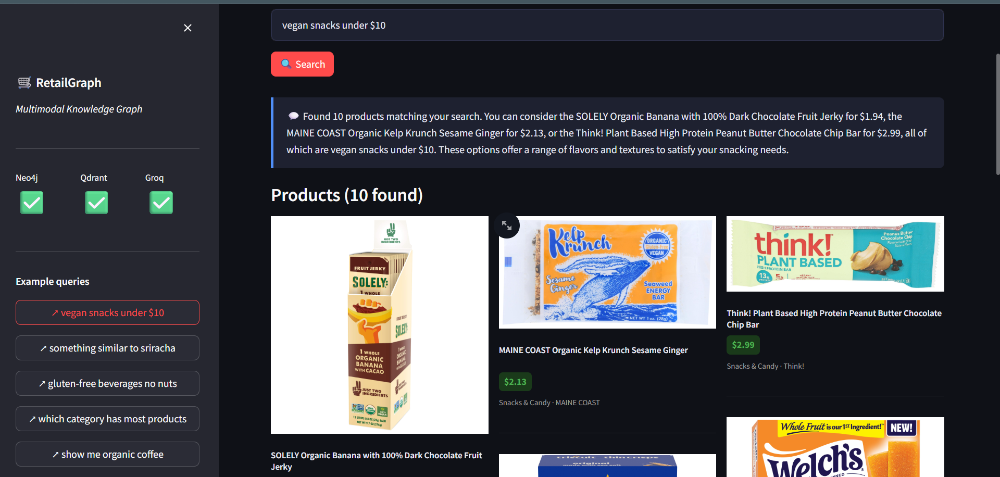
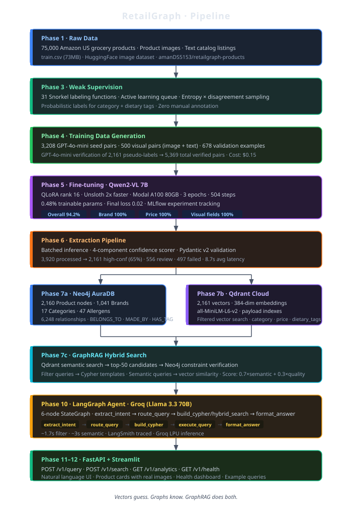
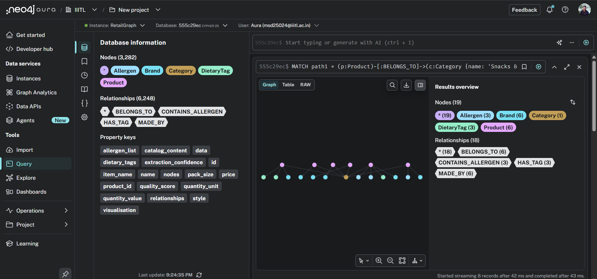

<div align="center">

# RetailGraph

**Multimodal entity extraction and knowledge graph platform for grocery product catalogs.**

Fine-tuned Qwen2-VL 7B extracts structured entities from product listings → loads into a typed Neo4j knowledge graph → queried in plain English by a LangGraph + GraphRAG agent.

[](https://python.org)
[](https://huggingface.co/Qwen/Qwen2-VL-7B-Instruct)
[](#results)
[](https://neo4j.com)
[](https://qdrant.tech)
[](https://langchain-ai.github.io/langgraph/)

</div>

---

## What It Does

Raw grocery listings (text + images) go in → a fine-tuned vision-language model extracts structured entities (brand, category, price, allergens, dietary tags) → everything loads into a typed Neo4j graph alongside Qdrant vectors → a LangGraph agent answers natural language questions using hybrid graph + vector retrieval.

> **"Vectors guess. Graphs know. GraphRAG does both."**



---

## Results

| Extraction Accuracy | Knowledge Graph | Vector Store |
|:---:|:---:|:---:|
| **94.2%** across 11 fields | **2,160** products · **6,248** relationships | **2,161** vectors · 384-dim |
| 678 val examples · 0 parse errors | 1,041 brands · 17 categories · 47 allergens | all-MiniLM-L6-v2 |

### Field accuracy — 678 held-out examples

| Field | Exact Match | LLM Judge |
|---|---|---|
| Brand · Price · Pack Size · Packaging (visual) | 100% | — |
| Quantity Unit | 92.6% | — |
| Allergen List | 91.5% | 4.68 / 5 |
| Quantity Value | 88.2% | — |
| Dietary Tags | 85.7% | 4.47 / 5 |
| Category | 78.3% | 4.22 / 5 |
| **Overall (mean of 11 fields)** | **94.2%** | 0 parse errors · 8.7s/product |

LLM-as-Judge (GPT-4o-mini) scores semantic correctness independently of exact string match — it surfaced **38 dietary-tag predictions that were correct but failed string equality**.

---

## Architecture



**1 — Extraction.** Qwen2-VL 7B fine-tuned with QLoRA (rank 16, 4-bit) on Modal A100 80GB via Unsloth. Pydantic v2 enforces the output schema with a 3-step retry loop; Snorkel provides weak supervision through **31 labeling functions**.

**2 — Knowledge Graph.** Extractions are deduplicated (RapidFuzz `token_sort_ratio ≥ 92`) and loaded into Neo4j as 5 node types and 4 relationship types (`BELONGS_TO`, `MADE_BY`, `HAS_TAG`, `CONTAINS_ALLERGEN`). The same records are embedded into Qdrant for semantic search.

**3 — Agent.** A 6-node LangGraph state machine — `extract_intent` → (router) → `build_cypher` | `hybrid_search` | `analytics` → `execute_query` → `format_answer` — backed by Groq Llama 3.3 70B. Intent decides the path: hard constraints go to Cypher, similarity goes to GraphRAG, aggregations go straight to Neo4j.



---

## Benchmark — GraphRAG vs VectorRAG vs Neo4j

20 queries · 3 query types · ground-truth scoring

| System | Accuracy | Avg Latency |
|---|---|---|
| Vector only (Qdrant) | 0 / 20 (0%) | ~0s |
| Graph only (Neo4j) | 20 / 20 (100%) | 1.3s |
| **GraphRAG (hybrid)** | **18 / 20 (90%)** | 9.99s |

| Type | Vector | Graph | GraphRAG |
|---|---|---|---|
| Multi-constraint (price + tags) | 0 / 7 | 7 / 7 | 7 / 7 |
| Semantic (similarity) | 0 / 7 | 7 / 7 | 7 / 7 |
| Analytics (aggregations) | 0 / 6 | 6 / 6 | 4 / 6 |

**Key finding:** vector search alone fails *every* query because it cannot enforce hard constraints — a $5 price cap or a `vegan` tag is not a direction in embedding space. GraphRAG matches Graph on constrained and semantic queries; its 2 misses are pure aggregations where there is no semantic component, so the agent routes those directly to Cypher instead.

---

## What Didn't Work

**Self-training collapsed.** After extracting 2,161 high-confidence products with the Round 1 model, I merged those pseudo-labels straight into the training set and retrained. Category accuracy *dropped* from 82% to 66% — the model learned to repeat its own errors, more confidently. The fix was a GPT-4o-mini verification pass over just the two weak fields (category + dietary_tags), correcting 487 categories and 298 tag sets for ~$0.15. Round 3 restored 94.2%.

**The lesson:** data quality beats data quantity. A teacher model needs to be more accurate than its student before its output is safe to train on.

---

## Quick Start

```bash
git clone https://github.com/AmanDataGuy/RetailGraph
cd RetailGraph
pip install -r requirements.txt
cp .env.example .env      # fill in NEO4J_*, QDRANT_*, GROQ_API_KEY
```

```bash
# Load the knowledge graph (one-time)
python scripts/create_indexes.py
python src/graph/builder.py
python src/graph/vector_store.py
```

```bash
# Run the stack
uvicorn src.api.main:app --reload --port 8000   # API + Swagger at /docs
streamlit run app.py                            # UI at :8501
```

Needs a Neo4j instance (AuraDB or `docker run neo4j`) and Qdrant (Cloud or `docker run -p 6333:6333 qdrant/qdrant`).

---

## Tech Stack

| Layer | Technology |
|---|---|
| Extraction model | Qwen2-VL 7B (QLoRA · Unsloth · Modal A100) |
| Weak supervision | Snorkel — 31 labeling functions |
| Schema validation | Pydantic v2 + retry loop |
| Knowledge graph | Neo4j AuraDB (Cypher) |
| Vector store | Qdrant (all-MiniLM-L6-v2, 384-dim) |
| Agent | LangGraph — 6-node state machine |
| Agent LLM | Groq · Llama 3.3 70B |
| Evaluation | LLM-as-Judge (GPT-4o-mini) |
| Backend / Frontend | FastAPI (5 endpoints) · Streamlit |

---

## Project Layout

```text
src/agent/       LangGraph agent — state, nodes, router, Groq wrapper
src/graph/       Neo4j builder + Cypher queries + Qdrant store + GraphRAG hybrid search
src/api/         FastAPI — /query /search /products /analytics /health
src/extraction/  Offline pipeline — schema, validator, normalizer, Snorkel weak supervision
src/ui/          Streamlit interface
training/        QLoRA fine-tuning, training-data generation, evaluation, LLM-as-Judge
scripts/         Index creation, graph loading, benchmark
```

---

<div align="center">

*Vectors guess. Graphs know. GraphRAG does both.*

**[LinkedIn](https://www.linkedin.com/in/aman-dataguy/) · [GitHub](https://github.com/AmanDataGuy/RetailGraph) · [HuggingFace Dataset](https://huggingface.co/datasets/amanDS5153/retailgraph-products)**

</div>
